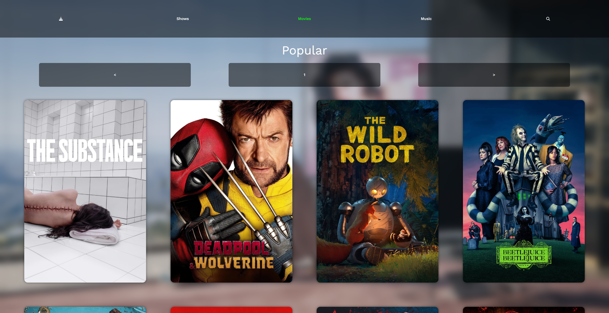
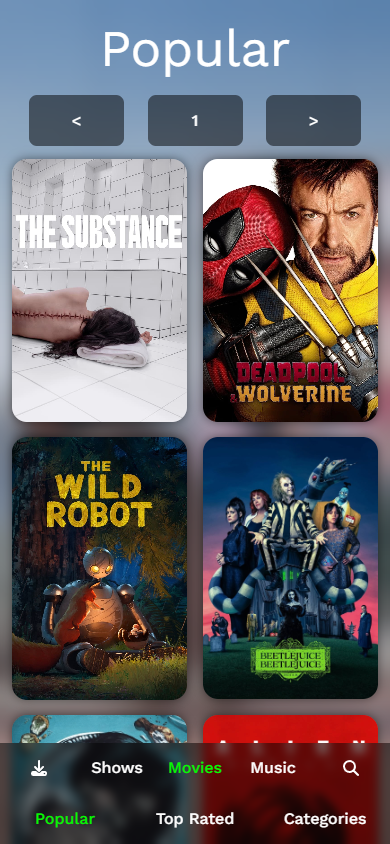
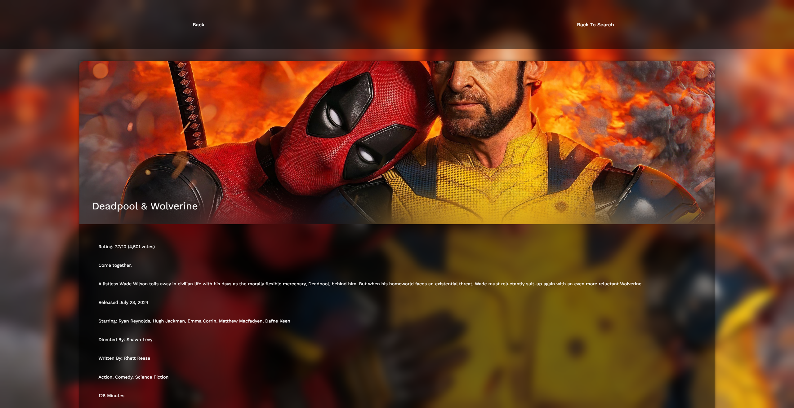
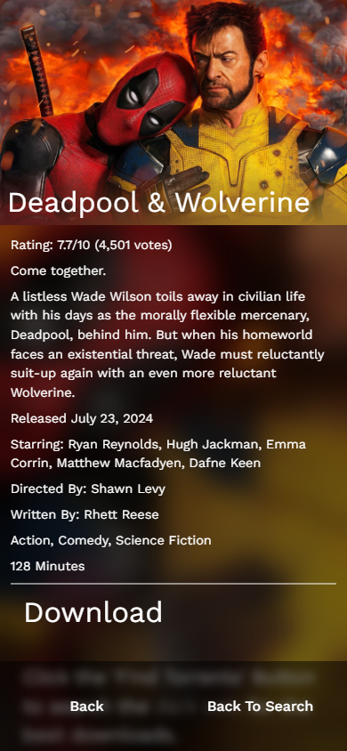
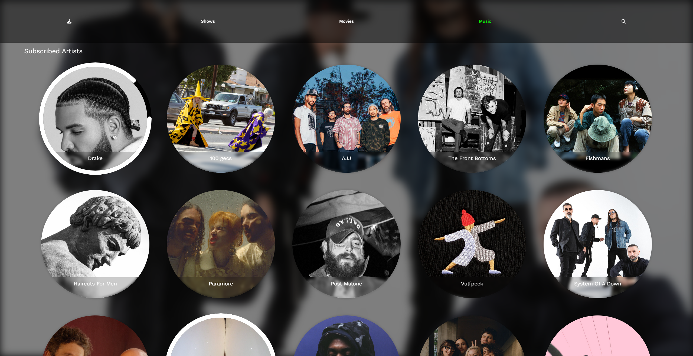
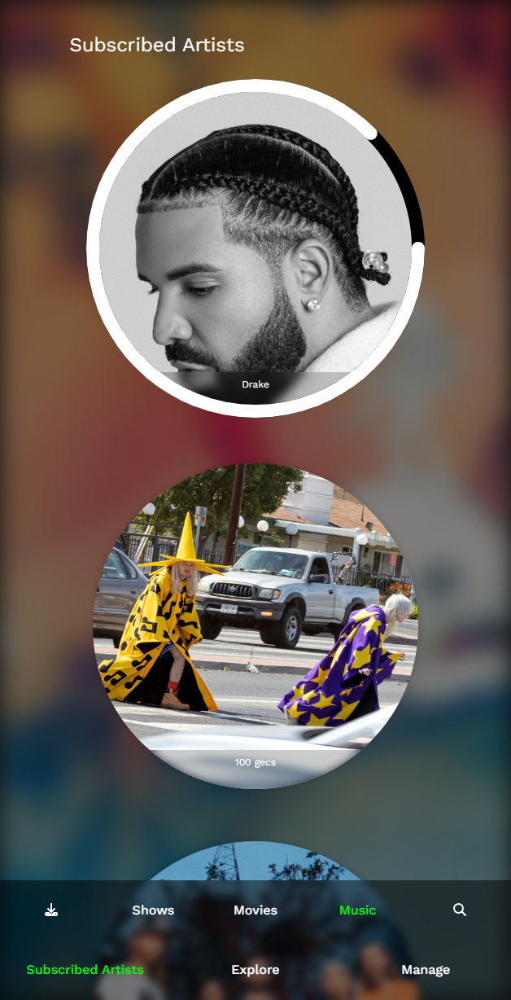
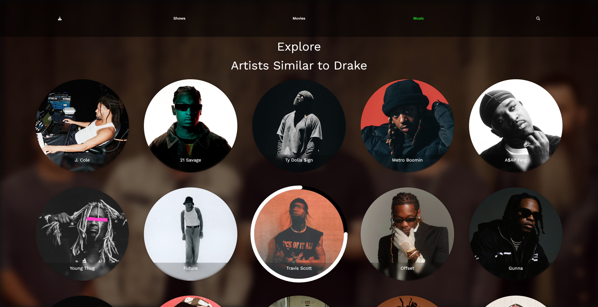
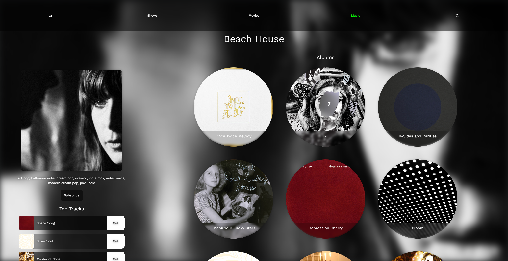

# Gimme

Gimme is an advanced torrent and music management application built using FastAPI and React. It provides a range of features for searching, downloading, and managing legally obtained torrents and music files.

## Features

- **Torrent Management**: Search and download legally obtained torrents from multiple sources.
- **Music Management**: Search, download, and manage your music library.
- **API Endpoints**: A comprehensive set of API endpoints to interact with the application programmatically.

## Screenshots
<!-- Add screenshots from the screenshots folder, there 6 of them from ss1.png to ss6.png
Use inline css to ensure they're centered -->

### Movie Browse Screen
<p align="center">
  
</p>

<p align="center">
  
</p>

### Movie Details Screen
<p align="center">
  
</p>

<p align="center">
  
</p>

### Music Library Screen
<p align="center">
  
</p>

<p align="center">
  
</p>

### Artist Discovery Screen
<p align="center">
  
</p>

### Artist Details Screen
<p align="center">
  
</p>


## Installation

1. Clone this repository:
    ```sh
    git clone https://github.com/strnadchristopher/gimme.git
    ```

2. Navigate to the backend directory and install the dependencies:
    ```sh
    cd gimme/backend
    pip install -r requirements.txt
    ```

3. Start the FastAPI server:
    ```sh
    uvicorn main:app --reload
    ```

4. Navigate to the frontend directory and install the dependencies:
    ```sh
    cd ../frontend
    npm install
    ```

5. Start the Vite development server:
    ```sh
    npm run dev
    ```

## Usage

### Torrent Management

- **Get current torrent queue**: `GET /api/torrents`
- **Search for torrents**: `GET /api/search/{media_type}/{movie_name}`
- **Download a torrent**: `POST /api/download`
- **Resume a torrent**: `POST /api/resume`

### Music Management

- **Get music library**: `GET /api/music_library`
- **Update shadow library**: `POST /api/update_shadow_library`
- **Search for a song**: `GET /api/search_song/{song_name}`

For a complete list of API endpoints and their usage, refer to the [API documentation](docs/api.md).

## Screenshots

Add screenshots here to showcase the application's UI and features.

## Legal and Ethical Use

Gimme is designed to manage torrents and music files that have been legally obtained. Please ensure that you are only using this application for files that you have the right to download and share.

## Contributing

We welcome contributions to enhance the functionality of Gimme. Please refer to [CONTRIBUTING.md](docs/CONTRIBUTING.md) for guidelines.

## License

This project is licensed under the MIT License. See the [LICENSE](LICENSE.md) file for details.