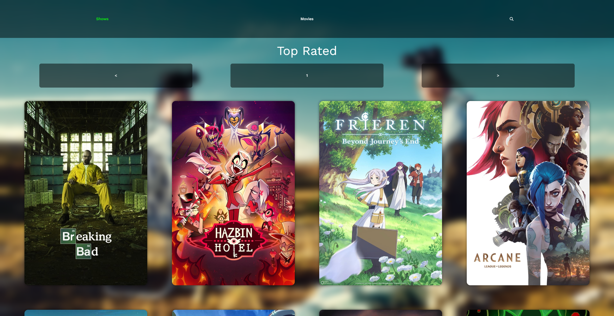
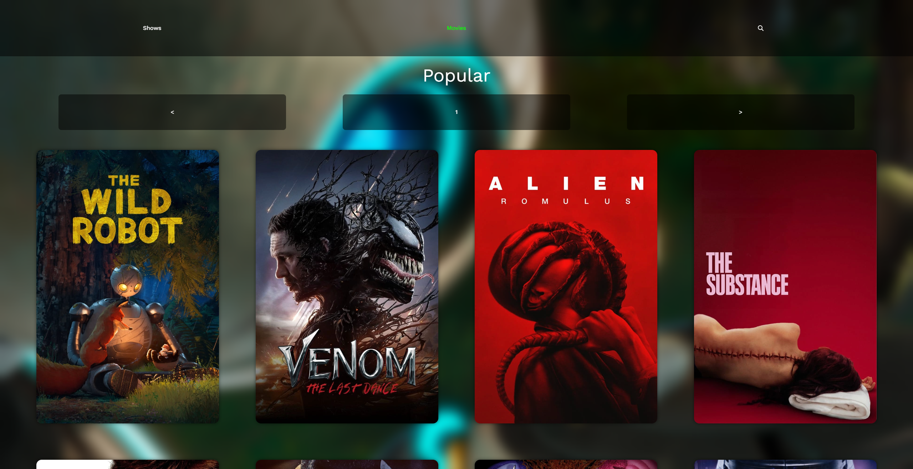
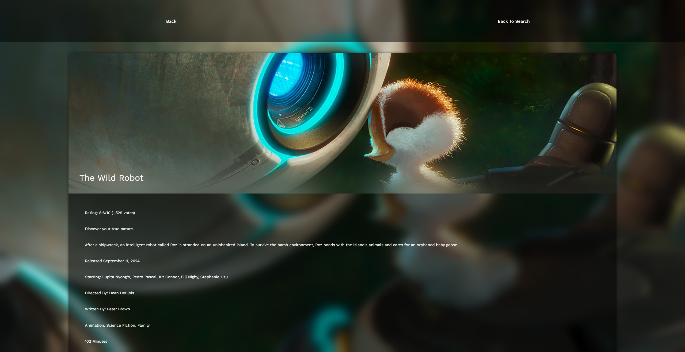
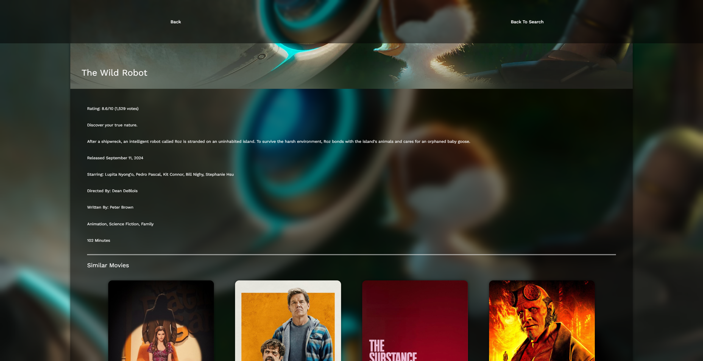

# Theatre Mode
This is a movie database web application that allows users to explore movies, view movie details, and search for movies. The application uses the [The Movie Database (TMDb) API](https://www.themoviedb.org/documentation/api) to fetch movie data.

You will need an API key from TMDb to run this application. You can sign up for a free account and get an API key [here](https://www.themoviedb.org/documentation/api).

## Screenshots
### Explore Screen
<p align="center">
  
</p>

<p align="center">
  
</p>

### Movie Details Screen
<p align="center">
  
</p>

<p align="center">
  
</p>

< align="center">
  
</p>

## Installation

1. Clone this repository:
    ```sh
    git clone https://github.com/strnadchristopher/theatre-mode.git
    ```

<!-- Step two is adding VITE_API_KEY which should be your moviedb api key -->
2. Create a `.env` file in the root directory of the project and add the following environment variables:
    ```sh
    VITE_API_KEY=your_moviedb_api_key
    ```

3. Start the Vite development server:
    ```sh
    npm run dev
    ```

3. Navigate to `http://localhost:5435` in your browser to view the application.
